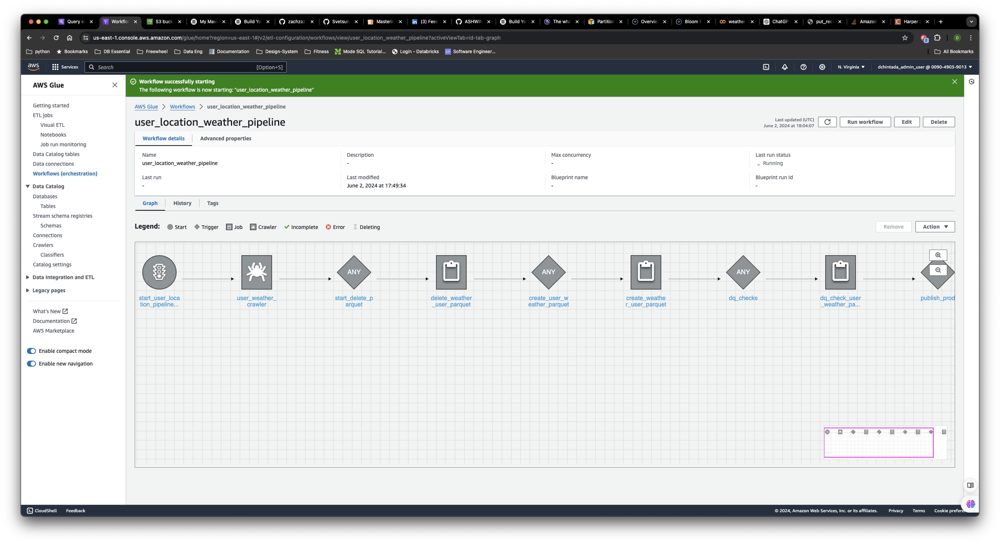
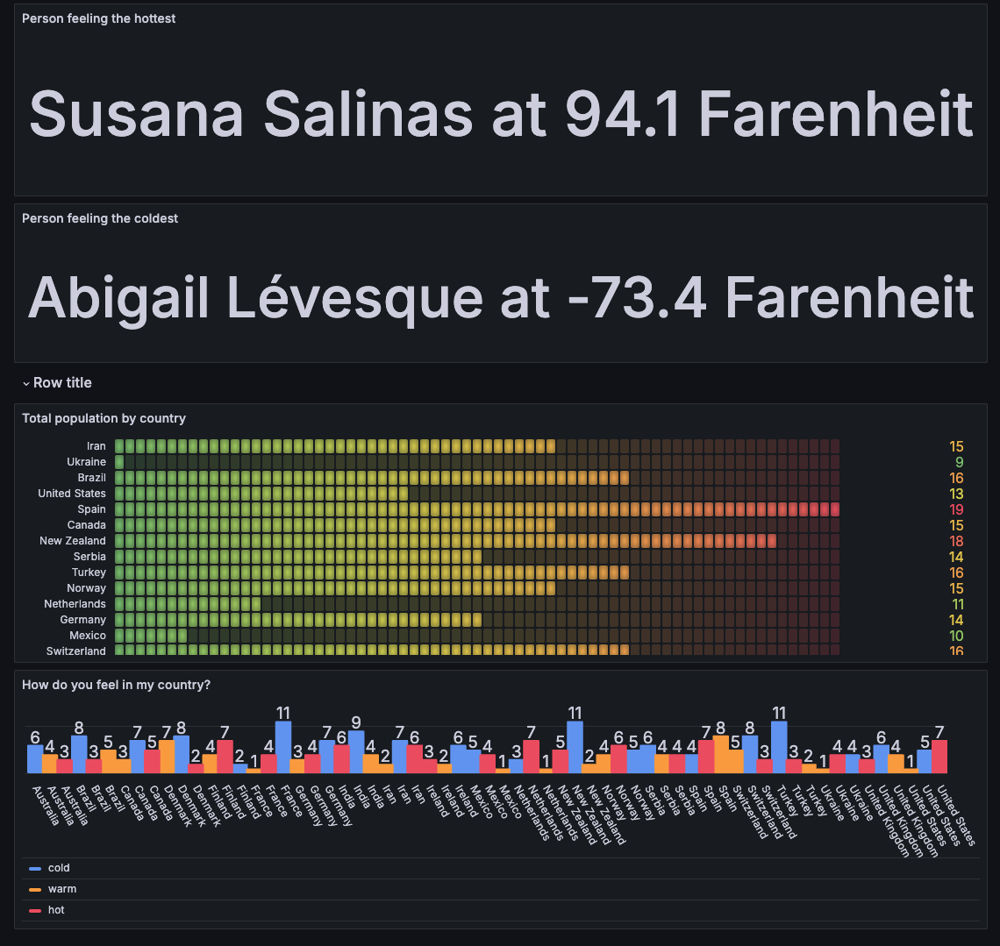

# Are you hot or cold today?

## Overview
This project leverages the capability of serverless technology to ingest and see how people across the globe are feeling today.

## APIs used:
- **Open Meteo Weather Data**: [Open Meteo Documentation](https://open-meteo.com/en/docs)
- **Random Users API**: [Random Users API Documentation](https://randomuser.me/documentation#howto)

## Tools used:
- **Extraction**: AWS Lambda, AWS Firehose
- **Transformation and Loading**: AWS Glue (Glue Jobs, Glue Workflow, Glue Crawlers)
- **Visualization**: Grafana
- **Data Exploration**: AWS Athena

## Architecture Diagram:

## Architecture
We are using AWS Lambda to pull 50 random users (Random Users API) at a time and pass their coordinates to the Open Meteo Weather API and place the returned data into AWS Firehose ([lambda_job/ingest_user_weather_data.py](lambda_job/ingest_user_weather_data.py)). The Firehose is configured to send data to an S3 Bucket (CSV raw format).

An on-demand AWS workflow is triggered to follow the WRITE-AUDIT-PUBLISH pattern and it does the following:

- **Crawler is triggered**: Crawls the S3 location and refreshes with new CSV data.
- **Delete Parquet table job**: Removes the previous day's parquet table and creates a new one with the refreshed data.
- **Recreate the parquet table**: Uses the raw S3 location that has CSV data and converts it to parquet.
- **Data quality checks**: Ensures we are receiving quality data; if not, the process fails.
- **Create a production-ready table**: After passing data quality checks.

## Visualizing
Data from the production table is then queried in Grafana, and visualizations are built to answer the questions listed above.

## Grafana Dashboard

https://divyachintada.grafana.net/d/fdnlc6n7n2j28d/warm-or-cold?orgId=1
